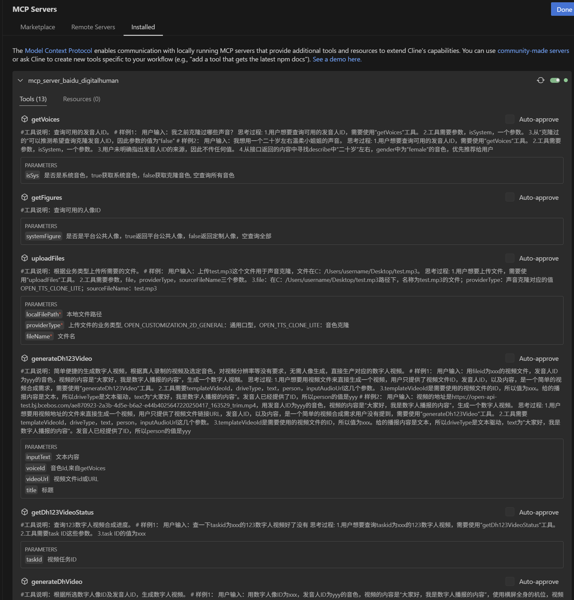
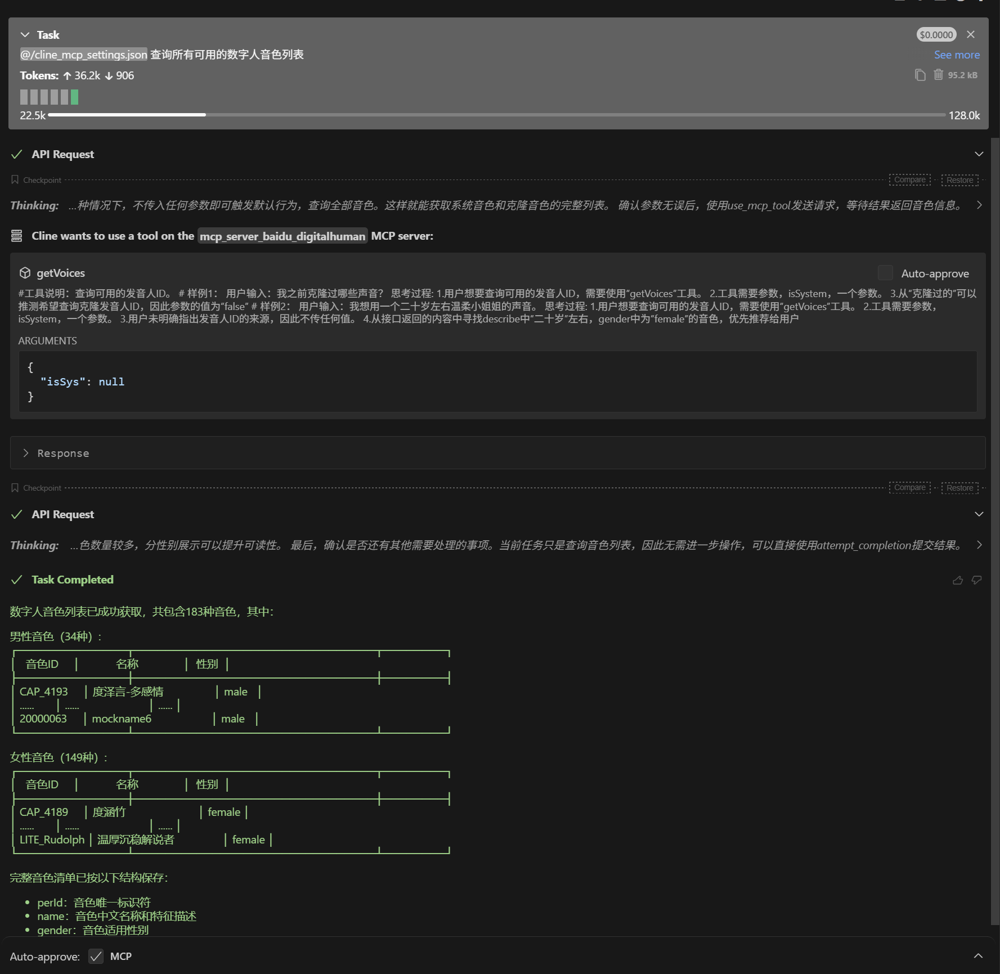

# 百度曦灵数字人 MCP Server

中文 | [English](./README.md) 

**概述**  
百度智能云曦灵数字人开放平台，现在已经全面适配MCP协议。欢迎各位创作者接入体验。

曦灵数字人提供的MCP Server，包含13个符合MCP协议标准的API接口，包括基础视频生成，高级视频生成，音色克隆等。

依赖MCP Python SDK开发，任意支持MCP协议的智能体助手（如Claude、Cursor、Cline以及千帆AppBuilder等）都可以快速接入。

[](LICENSE)   [](https://pypi.org/project/mcp-server-baidu-digitalhuman/)

## 工具
> 我们提供了多种工具，满足不同场景下的需求。让您在大模型中快速集成数字人服务，轻松打造数字人应用。
> 如您对数字人有更多期望，希望更加深入集成数字人服务，欢迎访问 [百度智能云曦灵数字人开放平台](https://xiling.cloud.baidu.com/open/overview) 联系我们。更多功能也将在MCP中逐步开放，敬请关注。

|功能|<div style="text-align: center">功能说明</div>|<div style="text-align: center">包含工具</div>|
|:---:|:---|:---|
|2D小样本数字人|根据上传真人录制的视频生成数字人像，仅可用于基础视频制作，数字人使用通用口型驱动。|&bull; generateLite2dGeneralVideo<br> &bull; getLite2dGeneralStatus|
|数字人视频合成|根据所选数字人像及音色，生成数字人视频|&bull; generateDhVideo<br> &bull; getDhVideoStatus|
|123数字人视频|根据真人录制的视频及选定音色，无需人像生成，直接生产对应的数字人视频|&bull; generateDh123Video<br> &bull; getDh123VideoStatus|
|语音合成|根据提供的文本内容及选定音色，无需生成视频，生产对应的音频|&bull; generateText2Audio<br> &bull; getText2AudioStatus|
|文件上传|根据业务类型上传所需要的文件。|&bull; uploadFiles|
|音色查询|查询可用的系统发音人ID。|&bull; getVoices|
|人像查询|查询可用的2D数字人人像ID。|&bull; getFigures|
|声音克隆|根据上传音频生成音色，可用于语音合成及视频制作。|&bull; generateVoiceClone <br>&bull; getVoiceCloneStatus|

### 1. 2D小样本数字人
- 功能说明：根据上传真人录制的视频生成数字人像，仅可用于基础视频制作，数字人使用通用口型驱动。
> 暂时只支持使用透明背景的webm视频来生成数字人像。
- 示例提示词：

> 用fileid为xxx的视频文件，生成数字人，命名为“zhangsan”，是个男生的形象。

> 查一下id为xxx的数字人好了没有。

> 我可以用哪些人像。

- 工具详情：

|工具名称|<div style="text-align: center">工具描述</div>|<div style="text-align: center">输入参数</div>|<div style="text-align: center">输出内容</div>|
|:---:|:---|:---|:---|
|generateLite2dGeneralVideo|根据上传真人录制的视频生成数字人像，仅可用于基础视频制作，数字人使用通用口型驱动。|&bull; name：对生成数字人像的命名，长度不超过50<br> &bull; gender：数字人的性别<br> &bull; keepBackground：是否保留视频背景，true为保留，false为去除，默认为false<br> &bull; templateVideoId：用于生成数字人像的视频对应的文件ID|&bull; figureId：根据上传真人录制的视频生成的数字人像ID |
|getLite2dGeneralStatus|&bull; 查询数字人像的生成的进度<br> &bull; 也可以用于查询有哪些可用的系统2D人像。|&bull; figureId：指定人像ID查询，为空则查询该账号下所有人像<br> &bull; systemFigure：查询平台的公共人像，为空：查询全部，true：返回平台公共人像，false：返回定制人像<br> &bull; trainSuccess：是否查询训练完成，状态可用的人像（为空：不进行过滤，true：只返回可用人像（平台公共人像和训练成功状态的定制人像），false：只返回排队中、训练中或训练失败的定制人像）<br> &bull; pageNo：页码，默认为1<br> &bull; pageSize：每页容量，默认10|&bull; figureId：根据上传真人录制的视频生成的数字人像ID<br> &bull; name：对生成数字人像的命名，长度不超过50<br> &bull; gender：数字人的性别<br> &bull; keepBackground：是否保留视频背景，true为保留，false为去除，默认为false<br> &bull; status：状态（LINE_UP（排队中）， GENERATING（训练中），SUCCESS（训练成功），FAILED（训练失败））<br> &bull; failedCode：失败错误码<br> &bull; failedMessage：制作失败原因|

### 2. 数字人视频合成
- 功能说明：根据所选数字人像及音色，生成数字人视频
- 示例提示词：

> 用数字人像ID为xxx，发音人ID为yyy的音色，视频的内容是“大家好，我是数字人播报的内容”，使用横屏全身的机位，视频背景用 https://digital-human-material.bj.bcebos.com/-%5BLjava.lang.String%3B%4046f6cc1e.png ，开启自动添加动作，开启字幕，生成一个1080P的数字人视频。

> 查一下taskid为xxx的数字人视频好了没有。

- 工具详情：

|工具名称|<div style="text-align: center">工具描述</div>|<div style="text-align: center">输入参数</div>|<div style="text-align: center">输出内容</div>|
|:---:|:---|:---|:---|
|generateDhVideo|根据所选数字人像及音色，生成数字人视频。|&bull; figureId：数字人像ID<br> &bull; driveType：驱动数字人的数据类型，支持文本驱动或者音频驱动<br> &bull; text：驱动类型为文本驱动时，必填的视频内容，长度不超过20000<br> &bull; person：驱动类型为文本驱动时，必填的发音人ID<br> &bull; inputAudioUrl：驱动类型为音频驱动时，必填的音频链接URL<br> &bull; width：输出视频分辨率的宽<br> &bull; hight：输出视频分辨率的高<br> &bull; cameraId：系统人像的机位设置，0:横屏半身, 1:竖屏半身, 2: 横屏全身, 3: 竖屏全身<br> &bull; enabled：是否开启字幕，true开启字幕，默认false不开启。<br> &bull; backgroundImageUrl：背景图片URL<br> &bull; autoAnimoji：系统人像自动添加动作，true为自动添加，默认为false不添加|&bull; taskId：当前视频合成的任务ID|
|getDhVideoStatus|查询数字人视频合成进度。|&bull; taskId：当前视频合成的任务ID|&bull; taskId：当前视频合成的任务ID<br> &bull; status：状态：SUBMIT（已提交待合成）,GENERATING（合成中）,SUCCESS（合成成功）,FAILED（合成失败）<br> &bull; failedCode：失败错误码<br> &bull; failedMessage：制作失败原因<br> &bull; videoUrl：任务ID对应的成功合成的视频文件地址，文件会保存 7 天|

### 3. 123数字人视频合成
- 功能说明：根据真人录制的视频及选定音色，无需人像生成，直接生产对应的数字人视频
- 示例提示词：

> 用fileid为xxx的视频文件，发音人ID为yyy的音色，视频的内容是“大家好，我是数字人播报的内容”，生成一个数字人视频。

> 视频的地址是https://open-api-test.bj.bcebos.com/ae870923-2a3b-4d5e-b6a2-e44b4025647220250417_163529_trim.mp4 ，用发音人ID为yyy的音色，视频的内容是“大家好，我是数字人播报的内容”，生成一个数字人视频。

> 查一下taskid为xxx的123数字人视频好了没有。

- 工具详情：

|工具名称|<div style="text-align: center">工具描述</div>|<div style="text-align: center">输入参数</div>|<div style="text-align: center">输出内容</div>|
|:---:|:---|:---|:---|
|generateDh123Video|根据真人录制的视频及选定音色，无需人像生成，直接成一个数字人视频。|&bull; templateVideoId：用于生成数字人视频的视频对应的文件ID<br> &bull; driveType：驱动数字人的数据类型，支持文本驱动或者音频驱动<br> &bull; text：驱动类型为文本驱动时，必填的视频内容，长度不超过20000<br> &bull; person：驱动类型为文本驱动时，必填的发音人ID<br> &bull; inputAudioUrl：驱动类型为音频驱动时，必填的音频链接URL|&bull; taskId：当前视频合成的任务ID|
|getDh123VideoStatus|查询123数字人视频合成进度。|&bull; taskId：当前视频合成的任务ID|&bull; taskId：当前视频合成的任务ID<br> &bull; status：状态：SUBMIT（已提交待合成）,GENERATING（合成中）,SUCCESS（合成成功）,FAILED（合成失败）<br> &bull; failedCode：失败错误码<br> &bull; failedMessage：制作失败原因<br> &bull; videoUrl：任务ID对应的成功合成的视频文件地址，文件会保存 7 天|

### 4. 语音合成
- 功能说明：根据提供的文本内容及选定音色，无需生成视频，生产对应的音频。
- 示例提示词：

> 用发音人ID为xxx的音色，内容是“大家好，我是数字人播报的内容”，生成音频。

> 查一下taskid为xxx的语音合成好了没有。

- 工具详情：

|工具名称|<div style="text-align: center">工具描述</div>|<div style="text-align: center">输入参数</div>|<div style="text-align: center">输出内容</div>|
|:---:|:---|:---|:---|
|generateText2Audio|根据提供的文本内容及选定音色，无需生成视频，生产对应的音频。|&bull; text：必填的文本内容，长度不超过2000<br> &bull; person：必填的发音人ID|&bull; taskId：当前音频合成的任务ID|
|getText2AudioStatus|查询音频合成进度。|&bull; taskId：当前视频合成的任务ID|&bull; status：状态：SUBMIT（已提交待合成）,GENERATING（合成中）,SUCCESS（合成成功）,FAILED（合成失败）<br> &bull; failedCode：失败错误码<br> &bull; failedMessage：制作失败原因<br> &bull; audioUrl：任务ID对应的成功合成的音频文件地址，文件会保存 7 天|


### 5. 文件上传
- 功能说明：平台支持上传音频、视频文件，用于后续的声音克隆，数字人制作，123数字人视频制作等。
- 示例提示词：

> 上传test.mp3这个文件用于声音克隆，文件在C：/Users/username/Desktop/test.mp3。

- 工具详情：

|工具名称|<div style="text-align: center">工具描述</div>|<div style="text-align: center">输入参数</div>|<div style="text-align: center">输出内容</div>|
|:---:|:---|:---|:---|
|uploadFiles|根据业务类型上传所需要的文件。|&bull; file：需要上传的文件<br> &bull; providerType：使用这个文件的业务类型，目前仅限于“2D小样本数字人制作”，“声音克隆”，“123数字人视频制作”三种业务类型。<br> &bull; sourceFileName：上传的文件名，必须填写正确的文件名称及后缀，比如：test.mp3。|&bull; fileId：文件ID<br> &bull; fileName：上传的文件名|


### 6. 音色查询
- 功能说明：查询可用的系统发音人ID。
- 示例提示词：

> 我之前克隆过哪些声音？

> 我想用一个二十岁左右温柔小姐姐的声音。

- 工具详情：

|工具名称|<div style="text-align: center">工具描述</div>|<div style="text-align: center">输入参数</div>|<div style="text-align: center">输出内容</div>|
|:---:|:---|:---|:---|
|getVoices|查询可用的发音人ID。|&bull; isSystem：“true”查询系统发音人ID，“false”查询克隆发音人ID，不传任何值则为查询可用发音人ID|&bull; perId：发音人ID<br> &bull; name：发音人名称<br> &bull; describe：音色特点的描述<br> &bull; gender：性别<br> &bull; systemProvided：是否是系统音色|

### 7. 人像查询
- 功能说明：查询可用的2D数字人人像ID。
- 示例提示词：

> 我之前生成过哪些人像？

> 有哪些可用的人像？

- 工具详情：

|工具名称|<div style="text-align: center">工具描述</div>|<div style="text-align: center">输入参数</div>|<div style="text-align: center">输出内容</div>|
|:---:|:---|:---|:---|
|getFigures|查询可用人像ID。|&bull; isSystem：“true”查询系统人像ID，“false”查询生成人像ID，不传任何值则为查询可用人像ID|&bull; figureId：2D人像ID<br> &bull; name：2D人像名称<br> &bull; gender：性别<br> &bull; systemProvided：是否是系统人像|


### 8. 声音克隆
- 功能说明：根据上传音频生成音色，可用于语音合成及视频制作。
- 示例提示词：

> 用文件id为xxx的音频文件克隆声音。命名为“zhangsan”，是一个三十岁左右中年男性的音色，用“这个是我克隆的声音”这段文本试听一下。

> 查一下id为xxx的声音克隆好了没有。

- 工具详情：

|工具名称|<div style="text-align: center">工具描述</div>|<div style="text-align: center">输入参数</div>|<div style="text-align: center">输出内容</div>|
|:---:|:---|:---|:---|
|generateVoiceClone|根据上传音频生成音色，可用于语音合成及视频制作。|&bull; name：对克隆音色的命名，长度不超过50<br> &bull; gender：发音人的性别<br> &bull; describe：对克隆音色的描述，长度不超过 100<br> &bull; uploadAudioId：用于克隆音色的音频对应的文件ID<br> &bull; example：用于试听的文本，长度不超过100|&bull; perId：被克隆音色的发音人ID |
|getVoiceCloneStatus|根据声音克隆任务的发音人ID，查询该任务目前的状态。|&bull; isSuccess：是否只查询克隆成功的任务(true: 只查询成功的任务， false: 查询全部克隆任务)<br> &bull; perId：查询指定发音人ID的任务|&bull; perId：被克隆音色的发音人ID<br> &bull; name：发音人的名称<br> &bull; describe：对克隆音色的描述<br> &bull; exampleText：用于试听的文本<br> &bull; examplAudioUrl：使用试听的文本合成的音频文件的链接<br> &bull; status：当前任务的状态，PREPARING(准备中), CLONING(克隆中), SUCCESS(克隆成功), FAIL(克隆失败)<br> &bull; reason：如果克隆失败，则此处会描述失败原因<br> &bull; gender：被克隆音色的发音人的性别|


## 快速开始

### 1. 领取试用额度
- 登录 [百度智能云曦灵数字人开放平台](https://xiling.cloud.baidu.com/open/overview) 点击左下角  

<a href="https://xiling.cloud.baidu.com/open/overview" title="额度领取">
  
</a>

- 进入 [组件管理](https://xiling.cloud.baidu.com/open/widgetConsole/list) 查看获取的组件额度

<a href="https://xiling.cloud.baidu.com/open/widgetConsole/list" title="额度查看">
  
</a>

### 2. 获取API Key和Secret Key
- 进入 [应用管理](https://xiling.cloud.baidu.com/open/appConsole/list) 配置需要使用的组件

<a href="https://xiling.cloud.baidu.com/open/appConsole/list" title="应用创建">
  
</a>

- 创建完成后即可获取 API Key(AppID) 和 Key和Secret Key(AppKey)

<a href="https://xiling.cloud.baidu.com/open/widgetConsole/list" title="应用创建">
  
</a>

### 3. MCP配置

**必要条件**
- Python 3.12 或更高版本
- 曦灵开放平台 API Key和 Secret Key

百度曦灵数字人MCP Server支持`Python`接入，推荐使用[uv](https://docs.astral.sh/uv/)工具。

**源码接入**  
如果你希望自定义曦灵数字人的能力，可以使用源码方式接入：
1. 安装uv  
参考[uv](https://docs.astral.sh/uv/)安装指南，确保命令行能执行`uvx`命令，或能通过路径找到安装的`uvx`工具
2. 将代码checkout到本地
3. 使用支持MCP的智能体助手，新增MCP配置
``` json
{
  "mcpServers": {
    "DH-STDIO": {
      "timeout": 60,
      "type": "stdio",
      "command": "uvx",
      "args": [
        "${path/to/dh-mcp-server}"
      ],
      "env": {
        "DH_API_AK": "${API Key}",
        "DH_API_SK": "${Secret Key}"
      }
    }
}
```
- 将${path/to/dh-mcp-server} 替换为你本地实际路径
- 将\${API Key}和${Secret Key} 替换为你实际的 `API Key` 和 `Secret Key`

**Python包接入**  
我们通过pypi发布了百度曦灵MCP Server: "mcp-server-baidu-digitalhuman"，你可以使用任意Python包管理工具获取
1. 使用uv安装
2. 使用pip安装
`pip install mcp-server-baidu-digitalhuman`
2. 使用支持MCP的智能体助手，新增MCP配置
```json
{
  "mcpServers": {
    "DH-STDIO": {
      "timeout": 60,
      "type": "stdio",
      "command": "uvx",
      "args": [
        "mcp-server-baidu-digitalhuman"
      ],
      "env": {
        "DH_API_AK": "${API Key}",
        "DH_API_SK": "${Secret Key}"
      }
    }
  }
}
```

### 4. 使用声明
当您使用以上工具前，请先阅读 [曦灵数字人定制组件克隆协议](https://cloud.baidu.com/doc/AI_DH/s/tm4grezib)。当您使用以上工具时，即表示您同意该协议。
   
## 开发
可以使用MCP Inspector 进行本地开发和调试:   
`npx @modelcontextprotocol/inspector uvx ${path/to/dh-mcp-server} `  
这个命令将在本地以开发模式运行，你可以使用MCP Inspector进行功能测试

## 测试
1. 配置好环境后，MCP智能体会自动获取所有可用的工具列表



2. 在对话框中，输入prompt: "查询所有可用的数字人音色列表"


## 许可
MIT © 百度曦灵数字人


## 讨论&反馈
如果您有任何问题或建议，请随时联系我们。
您可以通过以下方式联系我们：
- 客服电话：**400-920-8999**
- 合作咨询：[百度智能云曦灵数字人开放平台咨询](https://cloud.baidu.com/survey/assembly.html)
- 问题工单：[创建工单](https://console.bce.baidu.com/support/#/ticket/#/ticket/create)
- 官方助手：

